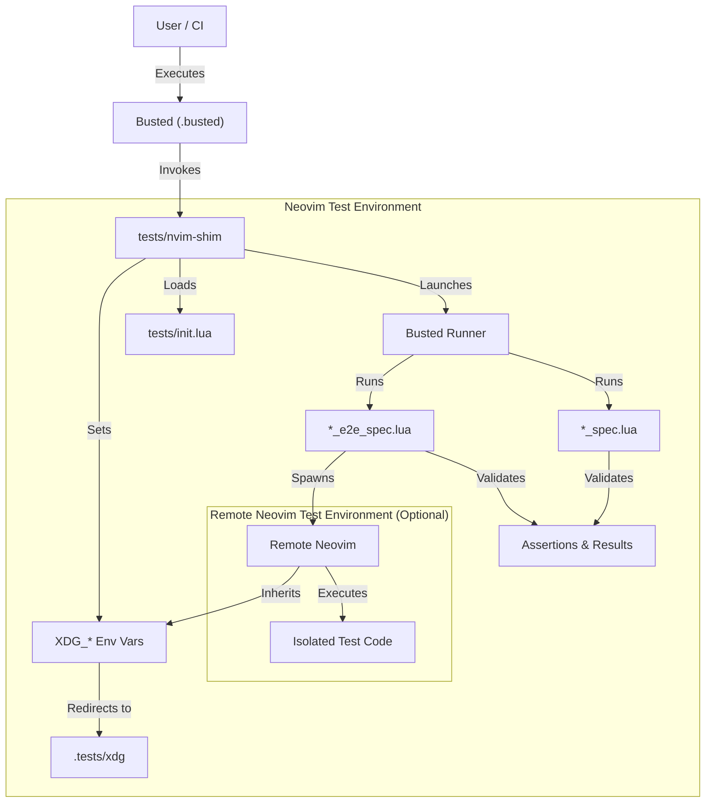

# 🛠️ Developer documentation

This is a documentation file for developers.

## Dev environment setup

This project requires the following tools:

- [Commitlint]
- [Just]
- [Lefthook]
- [Stylua]

Install lefthook:

```shell
lefthook install
```

Install LuaRocks environment:

```shell
luarocks make ROCKSPEC
# Install test dependencies.
# Force using the package tree.
luarocks test --prepare --tree=lua_modules
```

## Ops

To generate and open a test coverage report:

```shell
rm luacov.stats.out && just test && just generate-test-coverage-report && open luacov-html/index.html
```

## Test setup

This section explains how the testing harness works.
The whole setup uses Busted as the test runner and DSL for tests.

`busted` is configured by `.busted`.
It effectively launches `tests/nvim-shim BUSTED_RUNNER`.

`nvim-shim` sets up and exports configuration variables that isolate Neovim’s
configuration to one in `.tests/xdg`.
It also uses `tests/init.lua` for the setup.

Within that Neovim/Lua environment `BUSTED_RUNNER` runs `*_spec.lua` scripts.

Some spec files go a bit further and launch a remote-controlled Neovim to run
test code in isolation.
That remote-controlled Neovim inherits the config variables.
Assertions are still done in the `nvim-shim` environment though.



## ARDs

### Using LuaRocks

I set up this plugin as a Lua package using LuaRocks.
Neovim plugins are effectively Lua packages that just use Neovim as the
intepreter.
Using LuaRocks lets me easily install and use Busted or LuaCov for tests.

[Commitlint]: https://github.com/conventional-changelog/commitlint
[Lefthook]: https://github.com/evilmartians/lefthook
[Just]: https://just.systems/
[Stylua]: https://github.com/JohnnyMorganz/StyLua
