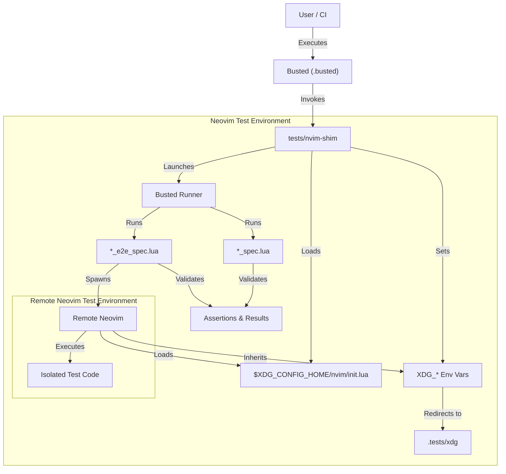
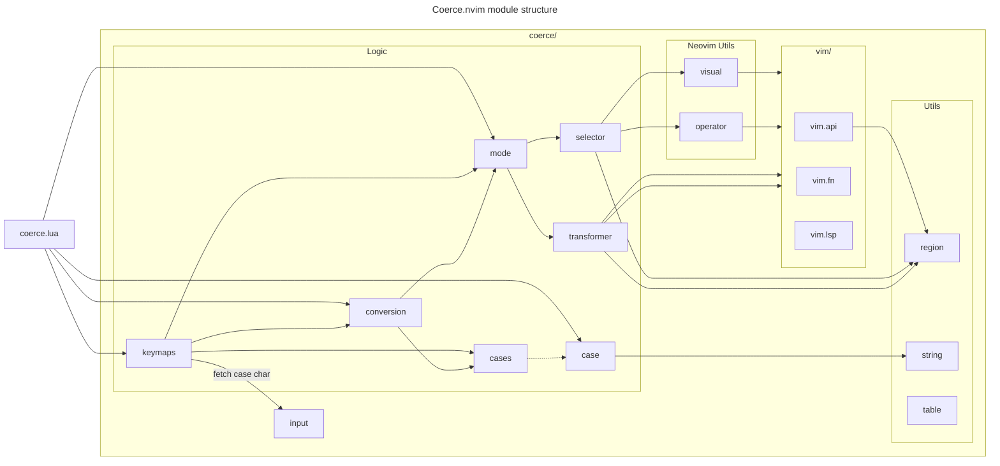

# 🛠️ Developer documentation

This is a documentation file for developers.

## Dev environment setup

This project requires the following tools:

- [Commitlint]
- [Just]
- [Lefthook]
- [LuaRocks]
- [Lychee]
- [Stylua]

Run the initialization script:

```shell
just init
```

## Ops

### Testing

To generate and open a test coverage report:

```shell
rm luacov.stats.out && just test && just generate-test-coverage-report && open luacov-html/index.html
```

### Version release & distribution

1. Cut off a version in `CHANGELOG.md` by moving the content of “Unreleased” to
   “TBR —\<date\>”.
1. Bump the version with a commit & tag:
   `just bump`.
1. Release the version commit & tag:
   `just push-current-version`.

## Test setup

This section explains how the testing harness works.
The whole setup uses Busted as the test runner and DSL for tests.

`busted` is configured by `.busted`.
It effectively launches `tests/nvim-shim BUSTED_RUNNER`.

`nvim-shim` sets up and exports configuration variables that isolate Neovim’s
configuration to one in `.tests/xdg`.
It also uses `tests/init.lua` for the setup.

Within that Neovim/Lua environment `BUSTED_RUNNER` runs `*_spec.lua` scripts.

Some spec files go a bit further and launch a remote-controlled Neovim to run
test code in isolation.
That remote-controlled Neovim inherits the config variables.
Assertions are still done in the `nvim-shim` environment though.


```mermaid
graph TD
    User["User / CI"] -- "Executes" --> Busted["Busted (.busted)"]
    Busted -- "Invokes" --> NvimShim["tests/nvim-shim"]

    subgraph Isolation["Neovim Test Environment"]
        NvimShim -- "Sets" --> XDG["XDG_* Env Vars"]
        NvimShim -- "Loads" --> InitLua["$XDG_CONFIG_HOME/nvim/init.lua"]
        NvimShim -- "Launches" --> BustedProcess["Busted Runner"]
        BustedProcess -- "Runs" --> E2eSpecFiles["*_e2e_spec.lua"]
        E2eSpecFiles -- "Spawns" --> RemoteNvim["Remote Neovim"]

        BustedProcess -- "Runs" --> SpecFiles["*_spec.lua"]
        XDG -- "Redirects to" --> TestXDG[".tests/xdg"]
        RemoteNvim -- "Inherits" --> XDG

        subgraph Remote["Remote Neovim Test Environment"]
            RemoteNvim -- "Executes" --> IsolatedCode["Isolated Test Code"]
        end

        RemoteNvim -- "Loads" --> InitLua["$XDG_CONFIG_HOME/nvim/init.lua"]

        SpecFiles -- "Validates" --> Assertions["Assertions & Results"]
        E2eSpecFiles -- "Validates" --> Assertions["Assertions & Results"]
    end
```

### Coverage

We initialize Luacov in Neovim’s init.lua.
Initializing Luacov in the most outer layer, Busted, didn’t work — Luacov wasn’t
accurately capturing tested code.

## Architecture


```mermaid
---
title: Coerce.nvim module structure
---
graph LR
  coerce[coerce.lua]

  subgraph "coerce/"
    input

    subgraph "Logic"
      case
      mode
      keymaps
      cases -.-> case
      transformer
      conversion ---> mode
      conversion ---> cases
      mode --> selector
      mode --> transformer
      keymaps ---> cases
      keymaps ---> mode
      keymaps ---> conversion
    end

    subgraph "Utils"
      region
      string
      table
    end

    subgraph "Neovim Utils"
      operator
      visual
    end

    subgraph "vim" [vim/]
      vim-api[vim.api]
      vim-fn[vim.fn]
      vim-lsp[vim.lsp]
    end

    case --> string
    transformer --> region
    selector --> region

    keymaps -- "fetch case char" --> input

    selector --> operator
    selector --> visual

    transformer --> vim
    transformer --> vim
    operator --> vim
    visual --> vim
  end

  coerce --> case
  coerce --> mode
  coerce --> conversion
  coerce --> keymaps

  vim-api --> region
```

### Module Breakdown

- **Entry point**:
  `coerce.lua` initializes the plugin and orchestrates the different components.
- **Logic**:
  Contains the core transformation logic, including case conversion rules and
  application strategies (local vs. LSP rename).
- **vim/**:
  Utilities for Neovim API.

## ARDs

### Using LuaRocks

I set up this plugin as a Lua package using LuaRocks.
Neovim plugins are effectively Lua packages that just use Neovim as the
intepreter.
Using LuaRocks lets me easily install and use Busted or LuaCov for tests.

### Defining keymaps

This plugin delegates final keymap definition to the user and only provides
`<Plug>` and Which Key bindings.

This avoids adding yet another flawed DSL for setting up keymaps.
Previous version had a DSL for setting up keymaps and masking them.
It was additional complexity, less powerful, and less flexible than direct
keymap setting.

### Lazy initialization

I did not optimize initial loading times of this plugin.
It’s short anyway (1–2 ms) and running setup on `VeryLazy` seems good enough.

Using `VeryLazy` is necessary anyway for this plugin to have ≈0
impact[^lazy-impact] on the initial render.

[Commitlint]: https://github.com/conventional-changelog/commitlint
[Lefthook]: https://github.com/evilmartians/lefthook
[LuaRocks]: https://luarocks.org/
[Lychee]: https://github.com/lycheeverse/lychee
[Just]: https://just.systems/
[Stylua]: https://github.com/JohnnyMorganz/StyLua

[^lazy-impact]:

Just having the plugin spec adds <1 ms to startup times.
