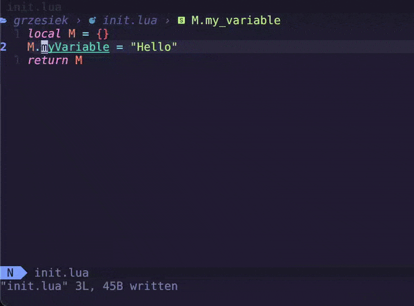

<!-- markdownlint-disable MD013 MD033 MD041 -->

<div align="center">
  <p>
    
  </p>
  <p>
    A Neovim plugin for changing keyword case.
  </p>
</div>

Coerce is a Neovim plugin that enables you to quickly change a keyword’s case.
Coerce’s framework is also capable of any short-text, single-command text
manipulation, e.g., turning selected text into its numeronym.

## Example session



## ⚡️ Requirements

- Neovim 0.9+
- Optional plugin dependencies:
  - [Which Key][which-key]

## 📦 Installation

Install the plugin with your preferred package manager, such as [Lazy]:

```lua
{
  "gregorias/coerce.nvim",
  tag = 'v2.2',
  config = true,
}
```

### Abolish setup

This plugin effectively replaces [Abolish]’s coercion functionality. If you
wish to keep it for its other features, you can disable the coercion feature
like so:

```lua
{
  "tpope/vim-abolish",
  init = function()
    -- Disable coercion mappings. I use coerce.nvim for that.
    vim.g.abolish_no_mappings = true
  end,
}
```

## 🚀 Usage

You can use Coerce to coerce [words][iskeyword] into various **cases** using
**modes**.

- A **case** is a function that changes a word into another word, e.g., the
  word’s camel case version.
- A **mode** specifies how Coerce triggers, selects and transforms the word,
  e.g., select whatever is currently visually selected.

### Quick start

1. Put the cursor inside [a keyword][iskeyword].
2. Press `crX`, where `X` stands for your desired case. Which key, if present,
   will show you hints.

### Built-in cases

| Case              | Key |
| :--               | :-- |
| camelCase         | c   |
| dot.case          | d   |
| kebab-case        | k   |
| [n12e][Numeronym] | n   |
| PascalCase        | p   |
| snake_case        | s   |
| UPPER_CASE        | u   |
| path/case         | /   |

### Built-in modes

| Vim mode | Keymap prefix | Selector                  | Transformer      |
| :--      | :--           | :--                       | :--              |
| Normal   | cr            | current [word][iskeyword] | LSP rename/local |
| Normal   | gcr           | motion selection          | local            |
| Visual   | gcr           | visual selection          | local            |

The default visual prefix is `gcr` and not `cr` in order to avoid a conflict with
[the default `c`](https://neovim.io/doc/user/change.html#v_c).

### Tips & tricks

#### Visually selecting a previously changed keyword

You may coerce a keyword in such a way that it stops being keyword, e.g., you
use the path case in most programming languages. In that case, just running
`cr` again won’t fully revert the case. You’ll need to visually select the word
to fix it.

To quickly select a changed keyword,
[you can configure a special keymap for doing that](https://vim.fandom.com/wiki/Selecting_your_pasted_text). For example, here’s how I have it set up:

```lua
require"which-key".register({
  g = {
    p = {
      -- "p" makes sense, gv selects the last Visual selection, so this one
      -- selects the last pasted text.
      function()
          vim.api.nvim_feedkeys("`[" .. vim.fn.strpart(vim.fn.getregtype(), 0, 1) .. "`]", "n", false)
      end,
      "Switch to VISUAL using last paste/change",
    },
  },
})
```

With that, I can use `gp` to select whatever I have just coerced.

## ⚙️ Configuration

### Setup

The default configuration looks like so:

```lua
require"coerce".setup{
  keymap_registry = require("coerce.keymap").keymap_registry(),
  -- The notification function used during error conditions.
  notify = function(...) return vim.notify(...) end,
  default_mode_keymap_prefixes = {
    normal_mode = "cr",
    motion_mode = "gcr",
    visual_mode = "gcr",
  },
  -- If you don’t like the default cases and modes, you can override them.
  cases = require"coerce".default_cases,
  modes = require"coerce".get_default_modes(self.keymap_prefixes),
}
```

You may freely modify the config parameters to your liking.

### Register a new case

You can register a new case like so:

```lua
require"coerce".register_case{
  keymap = "l",
  case = function(str)
    return vim.fn.tolower(str)
  end,
  description = "lowercase",
}
```

### Register a new mode

You can register a new mode like so:

```lua
require"coerce".register_mode{
  vim_mode = "v",
  keymap_prefix = "gc",
  selector = function(cb)
    local s, e = -- Your function that finds start and end points.
                 -- For example, returning {0, 0}, {0, 5} selects the first 6
                 -- characters of the current buffer.
    local region_m = require"coerce.region"
    cb(region_m(region_m.modes.INLINE, s, e))
  end,
  transformer = require"coerce.transformer".transform_local,
}
```

## ✅ Comparison to similar tools

[Text-case][text-case] is more feature-rich than Coerce, but if you just need
to change case of the current keyword, Coerce is simpler.

| Feature                            | Coerce | [Text-case][text-case] | [Abolish][abolish] |
| :--                                | :--:   | :--:                   | :--:               |
| Full Unicode support               | ✅     | ❌                     | ❌                 |
| [Which Key][which-key] integration | ✅     | ✅                     | ❌                 |
| [nvim-notify] integration          | ✅     | ❌                     | ❌                 |
| Current keyword coerce             | ✅     | ❌                     | ✅                 |
| Visual selection                   | ✅     | ✅                     | ❌                 |
| Motion selection                   | ✅     | ✅                     | ❌                 |
| LSP rename                         | ✅     | ✅                     | ❌                 |
| Kebab case                         | ✅     | ✅                     | ✅                 |
| [Numeronym] “case”                 | ✅     | ❌                     | ❌                 |
| Dot repeat support                 | ✅     | ✅                     | ✅                 |
| Custom case support                | ✅     | ❌                     | ❌                 |
| Custom mode support                | ✅     | ❌                     | ❌                 |

## 🙏 Acknowledgments

This plugin was inspired by [Abolish][abolish]’s coercion feature. I created
this plugin to address Abolish’s shortcomings, which are:

- No integration with [Which Key][which-key] or [Legendary].
- Little configurability. I couldn’t extend the plugin with new cases.

I used [Text-case][text-case]’s source code to inform myself on how to do
things in Neovim.

The logo is based on
[a fist SVG from SVG Repo](https://www.svgrepo.com/svg/29542/fist).

## 🔗 See also

- [Toggle](https://github.com/gregorias/toggle.nvim) — My Neovim plugin for toggling options.

[abolish]: https://github.com/tpope/vim-abolish
[iskeyword]: https://neovim.io/doc/user/options.html#'iskeyword'
[nvim-notify]: https://github.com/rcarriga/nvim-notify
[text-case]: https://github.com/johmsalas/text-case.nvim
[which-key]: https://github.com/folke/which-key.nvim
[Legendary]: https://github.com/mrjones2014/legendary.nvim
[Lazy]: https://github.com/folke/lazy.nvim
[Numeronym]: https://en.wikipedia.org/wiki/Numeronym#Numerical_contractions
